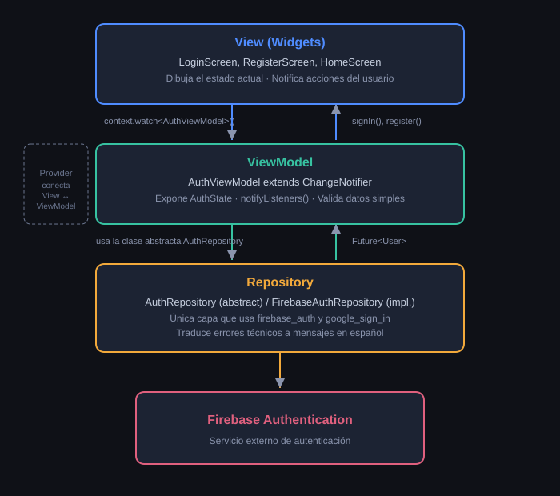

# Arquitectura MVVM

Este proyecto sigue el patrón **MVVM (Model - View - ViewModel)**, adaptado a las
convenciones idiomáticas de Flutter/Dart. El manejo de estado se implementa con el
paquete **Provider**, usando ChangeNotifier como equivalente a StateFlow.

## Diagrama de capas

## Responsabilidad de cada capa

### Models
- **User:** modelo de dominio propio, independiente del `User` de Firebase.
- **AuthState:** `sealed class` (disponible desde Dart 3) que representa el estado de la
  pantalla de autenticación (`AuthIdle`, `AuthLoading`, `AuthSuccess`, `AuthError`).

### Repositories
- **AuthRepository (clase abstracta):** define **qué** operaciones de autenticación
  existen, sin especificar cómo se implementan.
- **FirebaseAuthRepository (implementación):** única clase que importa `firebase_auth`
  y `google_sign_in`. Traduce entre el `User` de Firebase y el `User` propio, y
  traduce las excepciones técnicas a mensajes en español.

### ViewModels
- **AuthViewModel (extiende ChangeNotifier)**: expone un único `AuthState` observable.
  Valida datos simples antes de llamar al repositorio, y notifica cambios llamando a
  `notifyListeners()`.

### Screens (View)
- **LoginScreen, RegisterScreen**: son StatefulWidget, ya que necesitan manejar
  estado local (`TextEditingController` para los campos de texto).
- **HomeScreen:** es un StatelessWidget, ya que solo lee datos del ViewModel sin
  necesidad de estado local propio.

## Diferencia clave frente a la versión en Kotlin/Compose

| Kotlin (StateFlow) | Flutter (ChangeNotifier)                                                                                       |
|---|----------------------------------------------------------------------------------------------------------------|
| El estado se emite automáticamente como un stream reactivo. | El estado se guarda en una variable normal; hay que llamar manualmente a notifyListeners() cada vez que cambia. |
| collectAsState() conecta la UI al stream. | context.watch<T>() conecta el widget al ChangeNotifier.                                                        |
| Hilt inyecta dependencias automáticamente. | Provider se configura explícitamente una vez en main.dart (ChangeNotifierProvider).                            |

## ¿Por qué separar Repository de ViewModel?

El **AuthViewModel** depende únicamente de la clase abstracta **AuthRepository**, nunca
de **FirebaseAuthRepository** directamente. Esto permite sustituir la implementación
real por una falsa en pruebas unitarias, y mantiene la lógica de presentación
completamente desacoplada del SDK de Firebase.